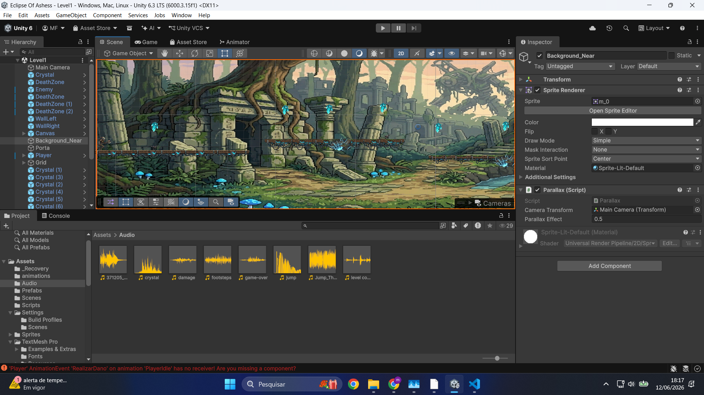
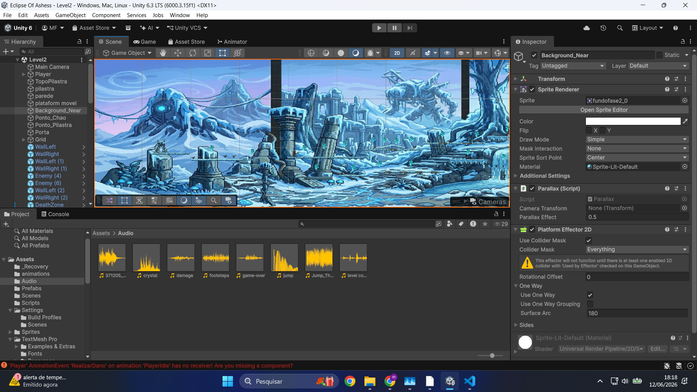
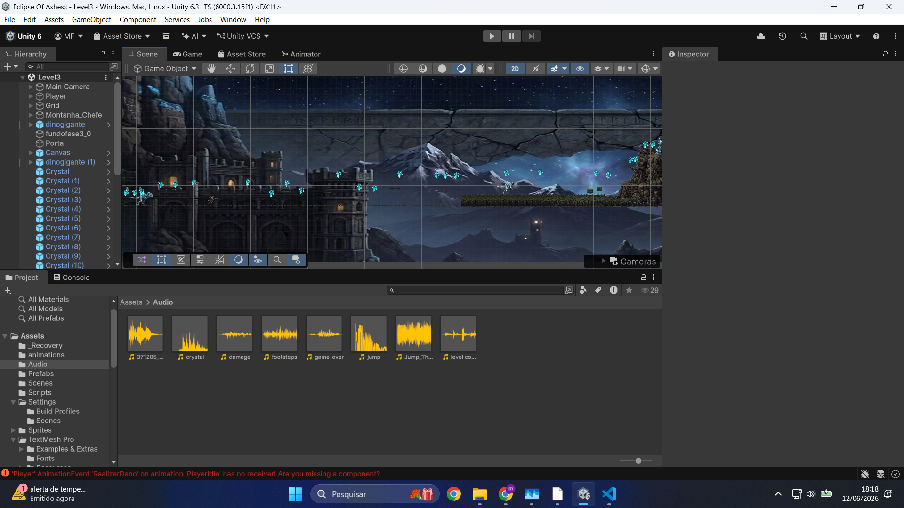
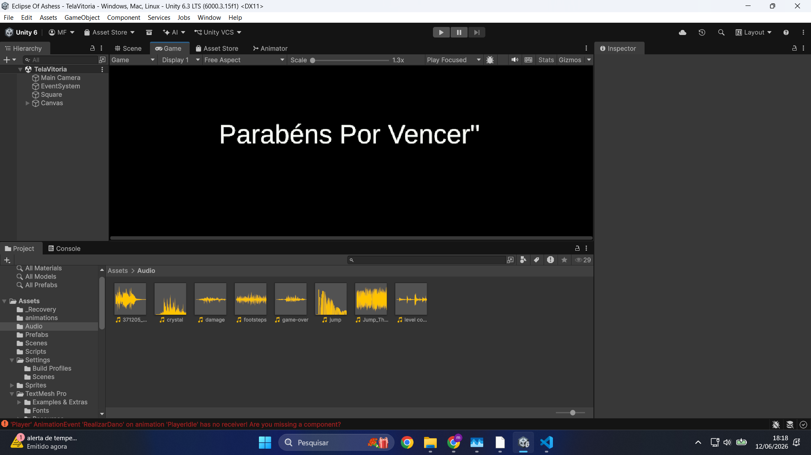

# Eclipse Of Ashes

## Descrição
Eclipse Of Ashes é um jogo de plataforma 2D desenvolvido na Unity 6. O jogador deve explorar cenários pós-apocalípticos, coletar cristais, derrotar inimigos e desbloquear habilidades especiais até enfrentar os chefes do final.

---

## Fase 1 - Ruínas Antigas

Nesta fase o jogador aprende as mecânicas básicas de movimentação, combate e coleta de cristais.

---

## Fase 2 - Terras Congeladas

Após coletar todos os cristais da Fase 1, o jogador desbloqueia a Super Lança.

---

## Fase 3 - Montanha do Chefe Final

Nesta fase o jogador enfrenta os Dinossauros Gigante. Ao coletar todos os cristais das três fases, o Laser é desbloqueado.

---

## Tela de Vitória

O jogador vence após derrotar o chefe final e completar todos os objetivos.

---

## Mecânicas

- Movimentação lateral
- Pulo
- Ataque com lança
- Super Lança
- Laser desbloqueável
- Sistema de vidas
- Coleta de cristais
- Inimigos com IA
- Chefe final
- Portais entre fases

---

## Controles

| Tecla | Ação |
|---------|---------|
| A / D | Mover |
| Espaço | Pular |
| Mouse Esquerdo | Atacar |
| Q | Disparar Laser |

---

## Progressão do Jogo

### Fase 1
- Coletar todos os cristais.
- Derrotar os inimigos.
- Desbloquear a Super Lança.

### Fase 2
- Coletar todos os cristais.
- Utilizar a Super Lança.
- Liberar acesso à fase final.

### Fase 3
- Coletar todos os cristais.
- Desbloquear o Laser.
- Derrotar o Dinossauro Gigante.

---

## Áudios

- Música de fundo
- Som de pulo
- Som de dano
- Som de coleta de cristais
- Som de Game Over
- Som de conclusão de fase

---

## Execução

1. Abrir o projeto na Unity 6.
2. Abrir a cena `Level1`.
3. Pressionar **Play**.

### Build

1. File → Build Profiles.
2. Adicionar todas as cenas:
   - Level1
   - Level2
   - Level3
   - TelaVitoria
3. Selecionar Windows.
4. Clicar em Build.

---

## Desenvolvido com

- Unity 6 LTS
- C#
- TextMeshPro
- Sistema de Parallax
- Animações 2D
